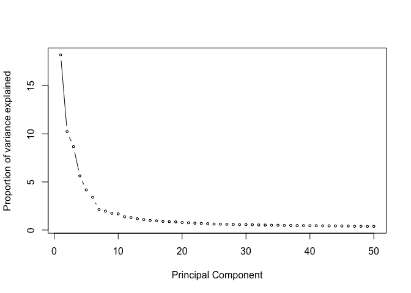
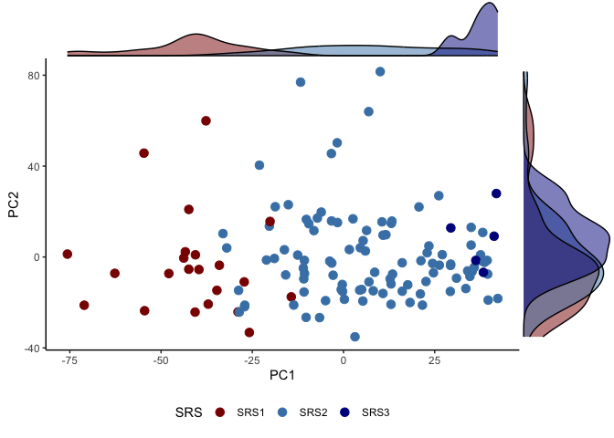

Statifying patients in the RESERVE-U study by SRS/SRSq
================
Kiki Cano-Gamez <kiki.canogamez@well.ox.ac.uk>
2024-03-28

## Background

This tutorial demonstrate how to use the SepstratifieR algorithm to
classify patients into SRS groups and predict their SRSq value. It uses
as a case study an RNA-sequencing data set of sepsis patients recruited
in Uganda, which is part of the RESERVE-U study.

For more information on the clinical characteristics of this cohort and
on how these data were generated, please refer to the 2024 publication
by Cummings et al.: <http://doi.org/10.1097/CCM.0000000000006023>

## Loading libraries

Before starting any analyses, you’ll need to make sure all the required
libraries are installed. To install all necessary libraries, along with
their dependencies, please run the following code block:

``` r
# CRAN packages
install.packages("tidyverse")
install.packages("cowplot")
install.packages("ggExtra")
install.packages("ggpubr")
install.packages("ggrepel")

# Bioconductor packages
if (!require("BiocManager", quietly = TRUE))
    install.packages("BiocManager")

BiocManager::install("SummarizedExperiment")
BiocManager::install("limma")
BiocManager::install("batchelor")
BiocManager::install("MatrixGenerics")

# GitHub packages
devtools::install_github("stephenturner/annotables")
devtools::install_github("jknightlab/SepstratifieR")
```

Now you should be able to successfully load these libraries:

``` r
library(tidyverse)
library(SummarizedExperiment)
library(annotables)
library(SepstratifieR)
library(limma)
library(cowplot)
library(ggExtra)
library(ggpubr)
library(ggrepel)
```

## Reading in data

To complete this tutorial, you will need to download the counts table
from the RESERVE-U study. This table is an expression matrix containing
raw counts for each gene, as measured using RNA-seq and quantified
bioinformatically. The file is available through the GitHub repository
designed for this workshop. Once you have downloaded it, make sure to
copy this file to your project directory so that R can find it.

We proceed to load the counts table using the read.table() function

``` r
RESERVEU_gex <- read.table(
  "./RESERVE_U_1_counts_normalized_adult.csv",
  sep=";", header=T, row.names = 1
  )
```

The first few lines of this table look as follows:

``` r
RESERVEU_gex[1:10,1:10]
```

    ##           sample101   sample102  sample103   sample104  sample119   sample121
    ## A1BG      37.595498   28.870179  35.718609   39.625564  27.301188   32.594727
    ## A1BG-AS1  16.879611   12.484402  19.560190   18.732085  13.650594   12.008584
    ## A1CF       3.069020    4.681651   4.252215    3.242092   0.000000    9.435316
    ## A2M      489.508723 1278.090636 690.559767 1632.933469 631.650203 1167.405886
    ## A2M-AS1   96.674137  430.711863 216.862981  239.914778 248.192614  441.744329
    ## A2ML1      7.672551    5.461926   7.653988   10.086507   2.481926    6.862048
    ## A2MP1     16.879611   72.565586  33.167279   81.052290  33.506003   56.611895
    ## A3GALT2   11.125198    8.583026   3.401772    6.844416  17.373483    7.719804
    ## A4GALT     4.603530   11.704127  15.307975   45.029050  16.132520   23.159411
    ## A4GNT      1.918138    0.000000   0.000000    0.000000   0.000000    0.857756
    ##           sample124   sample138    sample139   sample140
    ## A1BG      28.262094   27.657053   14.2599133  36.6446725
    ## A1BG-AS1  13.643770   13.316359    6.6546262  16.0879050
    ## A1CF       1.949110    2.048671    0.9506609   1.7875450
    ## A2M      421.007746 1989.259169 1622.7781300 571.1206267
    ## A2M-AS1  114.997486  641.233903  460.1198682 228.8057597
    ## A2ML1     22.414764    3.073006    7.6052871   7.1501800
    ## A2MP1      9.745550   72.727807   59.8916357  29.4944925
    ## A3GALT2    4.872775    2.048671    5.7039653   8.0439525
    ## A4GALT    33.134869   13.316359    5.7039653  66.1391649
    ## A4GNT      1.949110    2.048671    0.0000000   0.8937725

## Formatting data

While this table already contains all the information we need, its
format could be improved and made a lot more informative. Thus, we will
transform this data into a format specifically designed for gene
expression analysis called a ‘SummarizedExperiment’.

A SummarizedExperiment is a data structure which contains three
components:

- The data itself (usually a counts table with genes as rows and samples
  as columns)
- A table with annotations for each gene in the study (for example, the
  gene’s name, genomic position, gene type, etc…)
- A table with annotations for each sample in the study (for example,
  demographic information or phenotype information)

### Creating gene annotations

We start by compiling annotations for each of the genes in our
expression table. To do so, we will make use of the “Annotables”
library, which retrieves information from Ensembl and distributes it in
a format which is easy to plug into R.

We start by finding out which genes in the RESERVE-U RNA-seq experiment
have annotations available in the Ensembl (specifically, an Ensembl
version which matches the GRCh38 reference genome). We will subset our
expression table to only include annotated genes, removing any rows
which lack Ensembl annotations:

``` r
annotated_genes <- unique(intersect(grch38$symbol, rownames(RESERVEU_gex)))
RESERVEU_gex <- RESERVEU_gex[annotated_genes,]
```

Next, we fetch the Ensembl annotations for each of the genes in our
table. The annotations we are interested in are: gene ID (i.e. Ensembl
ID), gene name (i.e. common name from HUGO), chromosome, starting and
ending position of the gene, as well as gene family (e.g. protein
coding, non-coding RNA, miRNA, etc…). We reformat this information into
a suitable format using tidyverse, and then match the order of rows
between our counts table and gene annotations table, as shown in the
following code block.

``` r
gene_annotations <- data.frame(
  grch38 %>% 
    filter(symbol %in% annotated_genes) %>%
    filter(!duplicated(symbol)) %>%
    transmute(gene_id = ensgene,
              gene_name = symbol,
              chr = chr,
              start = start,
              end = end,
              biotype = biotype)
  )
rownames(gene_annotations) <- gene_annotations$gene_name
gene_annotations <- gene_annotations[rownames(RESERVEU_gex),]
```

The final gene annotations table looks as follows:

``` r
head(gene_annotations)
```

    ##                  gene_id gene_name chr     start       end        biotype
    ## TSPAN6   ENSG00000000003    TSPAN6   X 100627108 100639991 protein_coding
    ## TNMD     ENSG00000000005      TNMD   X 100584936 100599885 protein_coding
    ## DPM1     ENSG00000000419      DPM1  20  50934867  50959140 protein_coding
    ## SCYL3    ENSG00000000457     SCYL3   1 169849631 169894267 protein_coding
    ## C1orf112 ENSG00000000460  C1orf112   1 169662007 169854080 protein_coding
    ## FGR      ENSG00000000938       FGR   1  27612064  27635185 protein_coding

Finally, we set the rows of both our tables (expression matrix and gene
annotations) to be the Ensembl gene IDs. This is important, because
SepstratifieR identifies the genes needed for SRS prediction based on
their Ensembl IDs. It’s important to note that row names must match
between these two tables in order for us to successfully create a
SummarizedExperiment.

``` r
rownames(gene_annotations) <- gene_annotations$gene_id
rownames(RESERVEU_gex) <- rownames(gene_annotations)
```

### Normalising and log-transforming expression data

RNA-seq counts are significantly affected by sequencing depth (i.e. how
many reads were generated in total for that sample during sequencing),
which can generate systematic biases between samples if they have widely
different coverage. This, we will normalise our counts table by the
total sequencing depth of each sample. To make these numbers more
manageable, we multiply them by 1,000,000. This normalisation strategy
generates so called “counts per million reads (cpm)”.

``` r
RESERVEU_gex <- (RESERVEU_gex*1e6)/colSums(RESERVEU_gex)
```

RNA-seq counts tend to span a dynamic range, which means lowly expressed
genes have dozens of counts while highly expressed genes can have
hundreds to thousands of counts. This causes the distribution of gene
counts to have a dramatic right-tail skew, which precludes us from using
any method that relies on a normal or “quasi-normal” distribution.

To get around this issue, we apply a log transformation to the data.
Bringing counts to a logarithmic scale causes them to fall into a
distribution that is much closer to the normal/Gaussian distribution.

``` r
RESERVEU_gex <- log(RESERVEU_gex + 1)
```

The final gene expression unit is thus log-CPMs.

### Creating Summarized Experiment

Now that we have our data in the right format and scale, alongside
suitable gene annotations, we can create a SummarizedExperiment object.

We do this by combining both of these data sets together into a single
object.

``` r
RESERVEU <- SummarizedExperiment(
  assays = RESERVEU_gex,
  rowData = gene_annotations
  )
```

The final SummarizedExperiment object looks as follows:

``` r
RESERVEU
```

    ## class: SummarizedExperiment 
    ## dim: 27310 128 
    ## metadata(0):
    ## assays(1): ''
    ## rownames(27310): ENSG00000000003 ENSG00000000005 ... ENSG00000289313
    ##   ENSG00000289549
    ## rowData names(6): gene_id gene_name ... end biotype
    ## colnames(128): sample101 sample102 ... sample493 sample495
    ## colData names(0):

### Gene filtering

It is common practice in RNA-seq analysis to remove genes which are too
lowly expressed to provide any useful information. There are a variety
of ways to do this. Here, we will use a simple hard threshold and only
keep genes which show at least 1 log-CPM (2.7 CPMs) in 10 or more
samples.

``` r
RESERVEU <- RESERVEU[rowSums(assay(RESERVEU) > 1) > 10,]
```

We are now ready to start analysis

## Exploratory analysis

Before performing stratification, it is a good idea to explore the data
and make sure there are no systematic biases or batch effects which need
to be corrected for. Here, we will do that by using principal component
analysis (PCA) and related visualisation techniques.

### Dimensionality reduction and visualisation

We use the built in PCA function in base R (prcomp) to obtain principal
components for this data. Note that prcomp() expects our variables
(i.e. genes) to be encoded as columns, but out expression table has them
as rows. Thus, the expression matrix needs to be transposed with the t()
function before PCA computation.

``` r
pca_res <- prcomp(t(assay(RESERVEU)))
```

We can now retrieve both the PCA coordinates of each sample as well as
the amount of variation explained by each component.

``` r
pc_coords <- data.frame(cbind(pca_res$x, colData(RESERVEU)))
pc_vars <- round(pca_res$sdev^2/sum(pca_res$sdev^2)*100,2)
```

The following screeplot shows the amount of variance captured by each of
the first 50 principal components.
<!-- -->

It is clear from this visualisation that most of the variation in the
data set is captured by the first 5 principal components.

When focusing on the first two components (PC1 and PC2), samples look as
follow in PCA space:
<!-- -->

It is hard to understand what is driving this variation, as we don’t
have information on the different samples. However, there does not seem
to be evidence of any strong batch effects, which would show up here as
completely separate groups of points.

Thus, this data does not show evidence of evident biases or batch
effects, and we can now proceed to stratifying these patients into
sepsis endotypes.

## Stratification of patients by SRS

We will use SepstratifieR to predict both SRS endotype and SRSq score
for each patient in the RESERVE-U study. SepstratifieR uses a two step
process to predict SRS labels:

- It first aligns the data of interest to a reference set (mostly formed
  of GAinS RNA-seq samples and healthy volunteer RNA-seq samples) based
  on a set of 19 predictor genes
- It then uses the aligned data as input for a machine learning
  prediction model, which outputs SRS and SRSq predictions.

For more information on the inner workings of SepstratifieR, please
refer to its associated GitHub, where more extensive documentation is
available: <https://github.com/jknightlab/SepstratifieR>

SepstratifieR takes as an input a data frame with variables (i.e. genes)
as columns and samples as rows. Thus, we will need to extract the
expression table from our SummarizedExperiment object and transpose it
before feeding this data to SepstratifieR. SepstratifieR uses an exact
match of gene IDs to find the predictor genes, which is why genes should
be labelled according to their Ensembl ID.

Let’s proceed to predictiong SRS endotype and SRSq scores for each
sample in our data set:

``` r
SRS_predictions <- stratifyPatients(
  data.frame(t(assay(RESERVEU))),
  k=20,
  gene_set = "extended"
  )
```

    ## 
    ## Using the 'extended' gene signature for prediction...
    ## Fetching predictor variables...
    ## 
    ## Aligning data to the reference set...
    ## Number of nearest neighours set to k=20
    ## Identifying potential outlier samples...
    ## Stratifying samples into sepsis response signature (SRS) groups...
    ## Assigning samples a quantitative sepsis response signature score (SRSq)...
    ## Adding sample names to object...
    ## ... done!

The output from SepstratifieR is a “SepsisPrediction” object containing
a variety of information, such as the original data used for prediction,
the data after alignment to the reference, and the predicted SRS and
SRSq labels. This object looks as follows:

``` r
SRS_predictions
```

    ## SepsisPrediction
    ## 
    ## Gene set used:  extended 
    ## 128 samples
    ## 19 predictor variables
    ## 
    ## Predictor variables: ENSG00000144659, ENSG00000103423, ENSG00000135372, ENSG00000079134, ...
    ## Sample names: sample101, sample102, sample103, sample104, ...
    ## SRS: SRS2, SRS2, SRS2, SRS3, ...
    ## SRSq: 0.6728367, 0.3866288, 0.6169285, 0.06457483, ...

We can get a sense of the frequency of each SRS group in this cohort is
as follows:

``` r
table(SRS_predictions@SRS)
```

    ## 
    ## SRS1 SRS2 SRS3 
    ##   22  101    5

In this case, around 78% of patients get assigned to SRS2, with the
remaining 17% assigned to SRS1 and only 4% predicted to be SRS3. This
aligns with the expected SRS distribution in the septic population.

SepstratifieR also contains a number of auxiliary methods to aid
interpretation and help the user assess how reliable SRS predictions
are. We will start by plotting where the RESERVE-U samples map with
respect to the reference GAinS data used by SepstratifieR. In this plot,
the small background dots represent SepstratifieR’s reference (GAinS +
controls), and the bigger dots in the foreground represent the RESERVE-U
patients. We would expect RESERVE-U patients to fall on top of the
reference points. If this were not the case (for example, RESERVE-U
points forming an entirely separate population or being grossly
misaligned), then we would need to go back and check if any of the
assumptions of this analysis are violated.

Encouragingly, the samples in RESERVE-U seem well aligned with the
reference used by SepstratifieR.

``` r
plotAlignedSamples(SRS_predictions)
```

<!-- -->

SepstratifieR can also perform a sensitivity analysis, with the aim of
assessing how much predictions tend to differ when we change the value
of the internal ‘k’ parameter used by the algorithm. This parameter
corresponds to the number of nearest beighbours used to align the query
data to the reference data, and can often have a big impact on the final
predictions.

This SepstratifieR function computes SRS and SRSq predictions accross a
range of ‘k’ values, and then produces visualisations that enable us to
assess how stable or unstable these predictions tend to be over the ‘k’
range:

``` r
sensitivity_res <- runSensitivityAnalysis(data.frame(t(assay(RESERVEU))), verbose = T, gene_set = "extended")
```

    ## 
    ## Using the ' extended ' gene signature for prediction...
    ## The k parameter will iterate through: 14 26 39 52 64 77 90 103 115 128 
    ## Predicting SRSq scores at all k values...
    ## 
    ## 
    ## Using the 'extended' gene signature for prediction...
    ## Fetching predictor variables...
    ## 
    ## Aligning data to the reference set...
    ## Number of nearest neighours set to k=14
    ## Identifying potential outlier samples...
    ## Stratifying samples into sepsis response signature (SRS) groups...
    ## Assigning samples a quantitative sepsis response signature score (SRSq)...
    ## Adding sample names to object...
    ## ... done!
    ## 
    ## 
    ## Using the 'extended' gene signature for prediction...
    ## Fetching predictor variables...
    ## 
    ## Aligning data to the reference set...
    ## Number of nearest neighours set to k=26
    ## Identifying potential outlier samples...
    ## Stratifying samples into sepsis response signature (SRS) groups...
    ## Assigning samples a quantitative sepsis response signature score (SRSq)...
    ## Adding sample names to object...
    ## ... done!
    ## 
    ## 
    ## Using the 'extended' gene signature for prediction...
    ## Fetching predictor variables...
    ## 
    ## Aligning data to the reference set...
    ## Number of nearest neighours set to k=39
    ## Identifying potential outlier samples...
    ## Stratifying samples into sepsis response signature (SRS) groups...
    ## Assigning samples a quantitative sepsis response signature score (SRSq)...
    ## Adding sample names to object...
    ## ... done!
    ## 
    ## 
    ## Using the 'extended' gene signature for prediction...
    ## Fetching predictor variables...
    ## 
    ## Aligning data to the reference set...
    ## Number of nearest neighours set to k=52
    ## Identifying potential outlier samples...
    ## Stratifying samples into sepsis response signature (SRS) groups...
    ## Assigning samples a quantitative sepsis response signature score (SRSq)...
    ## Adding sample names to object...
    ## ... done!
    ## 
    ## 
    ## Using the 'extended' gene signature for prediction...
    ## Fetching predictor variables...
    ## 
    ## Aligning data to the reference set...
    ## Number of nearest neighours set to k=64
    ## Identifying potential outlier samples...
    ## Stratifying samples into sepsis response signature (SRS) groups...
    ## Assigning samples a quantitative sepsis response signature score (SRSq)...
    ## Adding sample names to object...
    ## ... done!
    ## 
    ## 
    ## Using the 'extended' gene signature for prediction...
    ## Fetching predictor variables...
    ## 
    ## Aligning data to the reference set...
    ## Number of nearest neighours set to k=77
    ## Identifying potential outlier samples...
    ## Stratifying samples into sepsis response signature (SRS) groups...
    ## Assigning samples a quantitative sepsis response signature score (SRSq)...
    ## Adding sample names to object...
    ## ... done!
    ## 
    ## 
    ## Using the 'extended' gene signature for prediction...
    ## Fetching predictor variables...
    ## 
    ## Aligning data to the reference set...
    ## Number of nearest neighours set to k=90
    ## Identifying potential outlier samples...
    ## Stratifying samples into sepsis response signature (SRS) groups...
    ## Assigning samples a quantitative sepsis response signature score (SRSq)...
    ## Adding sample names to object...
    ## ... done!
    ## 
    ## 
    ## Using the 'extended' gene signature for prediction...
    ## Fetching predictor variables...
    ## 
    ## Aligning data to the reference set...
    ## Number of nearest neighours set to k=103
    ## Identifying potential outlier samples...
    ## Stratifying samples into sepsis response signature (SRS) groups...
    ## Assigning samples a quantitative sepsis response signature score (SRSq)...
    ## Adding sample names to object...
    ## ... done!
    ## 
    ## 
    ## Using the 'extended' gene signature for prediction...
    ## Fetching predictor variables...
    ## 
    ## Aligning data to the reference set...
    ## Number of nearest neighours set to k=115
    ## Identifying potential outlier samples...
    ## Stratifying samples into sepsis response signature (SRS) groups...
    ## Assigning samples a quantitative sepsis response signature score (SRSq)...
    ## Adding sample names to object...
    ## ... done!
    ## 
    ## 
    ## Using the 'extended' gene signature for prediction...
    ## Fetching predictor variables...
    ## 
    ## Aligning data to the reference set...
    ## Number of nearest neighours set to k=128
    ## Identifying potential outlier samples...
    ## Stratifying samples into sepsis response signature (SRS) groups...
    ## Assigning samples a quantitative sepsis response signature score (SRSq)...
    ## Adding sample names to object...
    ## ... done!
    ## 
    ## Identifying mNN outliers at k=26...
    ## Estimating variance in SRSq prediction for different values of k...Plotting SRSq predictions as a function of k...

<!-- -->

    ## Plotting variance in SRSq estimation for each sample...

<!-- -->

    ## ...done!

In this case, we see that SRSq predictions stabilise for ‘k’ values
above 20, with little variation thereafter. The second plot shows this
variation more quantitatively as a variance. Most predictions show very
little variation.

Thus, based on these two sanity checks, we can conclude that
SepstratifieR predictions for this cohort are stable and reliable.

We now add the predictions from SepstratifieR as metadata to our
original Summarized Experiment object:

``` r
RESERVEU$SRS <- SRS_predictions@SRS
RESERVEU$SRSq <- SRS_predictions@SRSq
```

### Visualisation of predicted endotypes

Let’s now assess whether the predicted SRS labels correlate with the
variation captured in any of the top principal components. We combine
our SRS + SRSq predictions with our PCA coordiantes in a single table,
which we can then use for visualisations.

``` r
pc_coords <- data.frame(cbind(pca_res$x,colData(RESERVEU)))
```

PCA reveals that the SRS signature correlates strongly with the first
principal component. This tells us that SRS is amongst the top causes of
variation in this data, and that it goes beyond just the 19 genes used
for prediction.
<!-- --><!-- -->

## Identifying SRS-associated gene expression programs

We now that SRS is a transcriptomic phenotype which is formed of many
correlated genes, not just the 19 genes used for prediction. Thus,let’s
now assess if any other genes tend to vary with SRS by performing
differential gene expression testing.

There are many methods for differential expression testing. Here, we
will use limma, which was originally developed for microarray analysis
but is also applicable to RNA-seq data. Limma performs moderated
t-tests, followed by multiple testing correction.

We start by defining a model matrix for our comparison of interest. In
this case, we define SRSq as the independent variable in the model.

``` r
design_matrix <- model.matrix(~RESERVEU$SRSq)
```

We then test for an association between gene expression level and SRSq
using the lmFit and eBayes functions.

``` r
fit <- lmFit(assay(RESERVEU), design_matrix)
fit2 <- contrasts.fit(fit, coef = 2)
fit2 <- eBayes(fit2)
```

Finally, we retrieve the relevant statistics for any differentially
expressed genes from the fit object. For the purposes of this workshop,
we will define differentially expressed genes as any gene with an
absolute fold change of 3.5 or higher at an FDR of 0.05. A fold-change
of 3.5 is approximately equivalent to a 1-fold increase in gene
expression for every 0.3-unit increase in SRSq.

``` r
DEGs <- topTable(fit2, adjust="BH", number = nrow(RESERVEU))
DEGs$gene_id <- rownames(DEGs)
DEGs$gene_name <- rowData(RESERVEU)[DEGs$gene_id,]$gene_name
DEGs$DE <- abs(DEGs$logFC) >= log2(3.5) & DEGs$adj.P.Val <= 0.05
```

A volcano plot representation of differentialy expressed genes looks as
follows:
<!-- -->

Below are some example genes known to be differentially expressed
between SRS groups based on our previous work in the GAinS cohort.
<!-- -->

The top SRSq-associated genes identified in GAinS look as follows in
RESERVE-U:

    ## 100% of top SRSq-associated genes in GAinS also pass FDR correction in COMBAT

    ## NULL

    ## NULL

    ## NULL

    ## NULL

    ## NULL

<!-- -->

    ## NULL

## Exporting results

Finally, we can export the SummarizedExperiment object containig our SRS
predictions an RDS file for future reference:

``` r
saveRDS(RESERVEU, "../../data/RESERVE-U_Uganda/RESERVE-U_gex_log2-scale.rds")
write.table(colData(RESERVEU), "../../data/RESERVE-U_Uganda/RESERVE-U_SRS-assignments_19-gene-signature.tsv", sep = "\t", quote=F, row.names = T)
```

## R session details

``` r
sessionInfo()
```

    ## R version 4.1.0 (2021-05-18)
    ## Platform: aarch64-apple-darwin20 (64-bit)
    ## Running under: macOS Big Sur 11.5.2
    ## 
    ## Matrix products: default
    ## BLAS:   /Library/Frameworks/R.framework/Versions/4.1-arm64/Resources/lib/libRblas.dylib
    ## LAPACK: /Library/Frameworks/R.framework/Versions/4.1-arm64/Resources/lib/libRlapack.dylib
    ## 
    ## locale:
    ## [1] en_US.UTF-8/en_US.UTF-8/en_US.UTF-8/C/en_US.UTF-8/en_US.UTF-8
    ## 
    ## attached base packages:
    ## [1] parallel  stats4    stats     graphics  grDevices utils     datasets 
    ## [8] methods   base     
    ## 
    ## other attached packages:
    ##  [1] ggrepel_0.9.1               ggpubr_0.4.0               
    ##  [3] ggExtra_0.10.0              cowplot_1.1.1              
    ##  [5] limma_3.48.3                SepstratifieR_0.0.0.9000   
    ##  [7] annotables_0.1.91           SummarizedExperiment_1.22.0
    ##  [9] Biobase_2.52.0              GenomicRanges_1.44.0       
    ## [11] GenomeInfoDb_1.28.1         IRanges_2.26.0             
    ## [13] S4Vectors_0.30.0            BiocGenerics_0.38.0        
    ## [15] MatrixGenerics_1.4.2        matrixStats_0.62.0         
    ## [17] forcats_0.5.1               stringr_1.4.0              
    ## [19] dplyr_1.0.7                 purrr_0.3.4                
    ## [21] readr_2.1.2                 tidyr_1.2.0                
    ## [23] tibble_3.1.8                ggplot2_3.5.0              
    ## [25] tidyverse_1.3.2            
    ## 
    ## loaded via a namespace (and not attached):
    ##   [1] readxl_1.3.1                backports_1.4.1            
    ##   [3] plyr_1.8.6                  igraph_2.0.3               
    ##   [5] splines_4.1.0               BiocParallel_1.26.1        
    ##   [7] digest_0.6.29               foreach_1.5.1              
    ##   [9] htmltools_0.5.3             fansi_0.5.0                
    ##  [11] magrittr_2.0.3              ScaledMatrix_1.0.0         
    ##  [13] googlesheets4_1.0.0         tzdb_0.2.0                 
    ##  [15] recipes_0.1.16              modelr_0.1.8               
    ##  [17] gower_0.2.2                 colorspace_2.0-2           
    ##  [19] rvest_1.0.2                 haven_2.4.3                
    ##  [21] xfun_0.32                   crayon_1.5.1               
    ##  [23] RCurl_1.98-1.4              jsonlite_1.8.0             
    ##  [25] survival_3.2-12             iterators_1.0.13           
    ##  [27] glue_1.6.2                  gtable_0.3.0               
    ##  [29] gargle_1.2.0                ipred_0.9-11               
    ##  [31] zlibbioc_1.38.0             XVector_0.32.0             
    ##  [33] DelayedArray_0.18.0         car_3.1-0                  
    ##  [35] BiocSingular_1.8.1          SingleCellExperiment_1.14.1
    ##  [37] abind_1.4-5                 scales_1.3.0               
    ##  [39] pheatmap_1.0.12             DBI_1.1.2                  
    ##  [41] rstatix_0.7.0               miniUI_0.1.1.1             
    ##  [43] Rcpp_1.0.7                  xtable_1.8-4               
    ##  [45] rsvd_1.0.5                  lava_1.6.9                 
    ##  [47] ResidualMatrix_1.2.0        prodlim_2019.11.13         
    ##  [49] httr_1.4.2                  RColorBrewer_1.1-2         
    ##  [51] ellipsis_0.3.2              pkgconfig_2.0.3            
    ##  [53] farver_2.1.0                scuttle_1.2.1              
    ##  [55] nnet_7.3-16                 dbplyr_2.1.1               
    ##  [57] utf8_1.2.2                  caret_6.0-88               
    ##  [59] tidyselect_1.1.1            labeling_0.4.2             
    ##  [61] rlang_1.1.3                 reshape2_1.4.4             
    ##  [63] later_1.3.0                 munsell_0.5.0              
    ##  [65] cellranger_1.1.0            tools_4.1.0                
    ##  [67] cli_3.6.2                   generics_0.1.3             
    ##  [69] broom_0.7.12                batchelor_1.8.1            
    ##  [71] evaluate_0.16               fastmap_1.1.0              
    ##  [73] yaml_2.3.5                  ModelMetrics_1.2.2.2       
    ##  [75] knitr_1.39                  fs_1.5.2                   
    ##  [77] randomForest_4.6-14         nlme_3.1-152               
    ##  [79] sparseMatrixStats_1.4.2     mime_0.11                  
    ##  [81] xml2_1.3.3                  compiler_4.1.0             
    ##  [83] rstudioapi_0.13             ggsignif_0.6.3             
    ##  [85] reprex_2.0.1                stringi_1.7.8              
    ##  [87] highr_0.9                   lattice_0.20-44            
    ##  [89] Matrix_1.5-1                vctrs_0.5.2                
    ##  [91] pillar_1.8.0                lifecycle_1.0.3            
    ##  [93] BiocNeighbors_1.10.0        data.table_1.14.6          
    ##  [95] bitops_1.0-7                irlba_2.3.3                
    ##  [97] httpuv_1.6.5                R6_2.5.1                   
    ##  [99] promises_1.2.0.1            codetools_0.2-18           
    ## [101] MASS_7.3-54                 assertthat_0.2.1           
    ## [103] rprojroot_2.0.2             withr_3.0.0                
    ## [105] GenomeInfoDbData_1.2.6      hms_1.1.1                  
    ## [107] grid_4.1.0                  rpart_4.1-15               
    ## [109] beachmat_2.8.1              timeDate_3043.102          
    ## [111] class_7.3-19                rmarkdown_2.14             
    ## [113] DelayedMatrixStats_1.14.2   carData_3.0-5              
    ## [115] googledrive_2.0.0           pROC_1.17.0.1              
    ## [117] shiny_1.7.1                 lubridate_1.8.0
